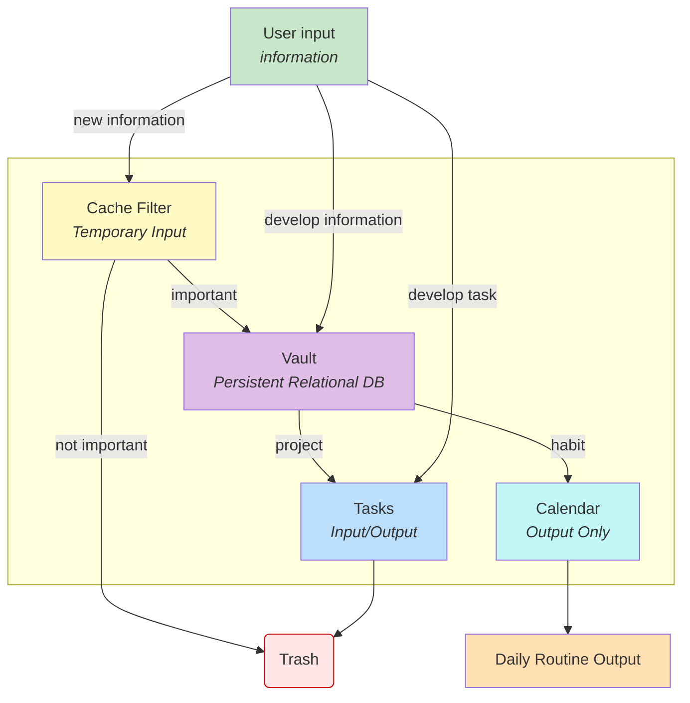

# SPA — System for Thought and Action

> **A modular system to think clearly and execute reliably.**  
SPA connects deep thinking, goal planning, and daily tasks in a **bidirectional loop** so insights turn into action — and action refines insight.

[Docs (EN/ES)](docs/docs.md) · [Issues](https://github.com/leonardespi/spa/issues) · [Contributing](information/CONTRIBUTING.md) · [Code of Conduct](information/CODE_OF_CONDUCT.md) · [License (MIT)](information/LICENSE)

[](https://github.com/leonardespi/spa/commits)
[](https://github.com/leonardespi/spa/issues)
[](docs/docs.md)
[](LICENSE)

---

## Why SPA?

- **Creates knowledge, not just stores it.** Designed to **fuse** ideas across life domains and mature them over time.
- **Bidirectional by design.** Strategy breaks down into tasks; daily notes feed back into strategy.
- **Modular & tool-agnostic.** Plain files and simple scripts; extend or swap modules freely.
- **For builders.** Optimized for people who ship — authors, engineers, founders.

---

## Architecture



---

## Repository Structure

General repo structure
```
repo/
├─ docs/                   # en and es documentation on spa
├─ scripts/                # install script for developers
├─ information/            # code of conduct, contributions, license
├─ spa/                    # Structure for manual install
└─ README.md               # Summary
```

`spa` specfic structure
```
spa/
├─ core.md                 # First principles / operating rules
├─ domains/                # Broad domains (life/work pillars)
├─ areas/                  # Ongoing areas of responsibility (AoRs)
├─ projects/               # Time-bounded outcomes and plans
└─ templates/              # Scaffolds for notes, projects, reviews
```

> **Start here:** Edit `core.md` with your principles. Then create your first project in `projects/`.


## Quickstart 

### Developers (with cli)

*(The bash script will ask you some questions from the cli, you must answer them faithfully to generate a first version of your spa model)*

```bash
# 1) Clone
git clone https://github.com/leonardespi/spa.git && cd spa

# 2) Execute the script
 bash scripts/install.sh

```

### Non-Developers (Manual)

*(The non developer route is significantly more complex, you can download the repo as a zip and inside of spa there is an empty first version, check the docs to understand how to fill them)*

1. **Download ZIP:** On the repo page, click **<> Code → Download ZIP**.
2. **Unzip** anywhere you like.
3. **Open** `docs/docs.md` and follow the manual steps (no command line required).


---

## Documentation

* **Start here:** [docs/docs.md](docs/docs.md) (EN/ES)
* **Core concepts:** Modularity, Knowledge Fusion, Bidirectional Flow
* **Templates:** Project brief, weekly review, task ledger
* **Patterns:** Domain → Area → Project mapping, archival strategy
* **FAQ/Troubleshooting:** Common setup issues and fixes

---

## Troubleshooting / FAQ

* **No Git / no terminal?**
  Use **Download ZIP** and start from `docs/docs.md`.

* **Where do I write first?**
  `core.md` → then your first project in `/projects/`.

* **Do I need Obsidian/Notion?**
  No. SPA is **plain-text first**. Use any editor; integrations are optional. But Obsidian is recommend for the graph views.

---

## Contributing

We welcome issues, ideas, and PRs. Please read [CONTRIBUTING.md](information/CONTRIBUTING.md) and follow the [Code of Conduct](information/CODE_OF_CONDUCT.md).

---

## License

This project is licensed under the **MIT License**. See [LICENSE](information/LICENSE).

