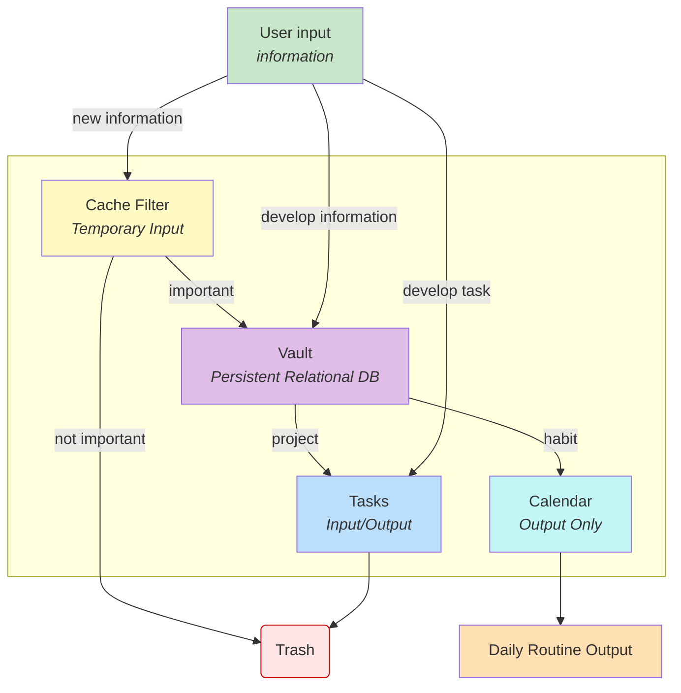
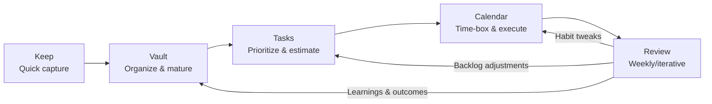
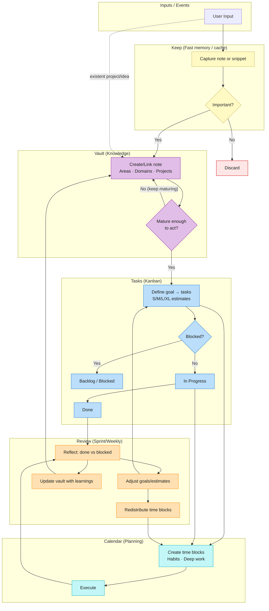

# System for Thought and Action (SPA)

[](docs.md) [](docs.es.md)

## Table of Contents

1. [Overview](#overview)
3. [System Goal](#system-goal)
4. [Audience](#audience)
5. [Advantages & Benefits](#advantages--benefits)
6. [Requirements & Tools](#requirements--tools)
7. [Architecture](#architecture)
8. [Basic Usage Example](#basic-usage-example)
9. [Internal Conventions](#internal-conventions)
10. [System Components](#system-components)
11. [Workflows](#workflows)
12. [Review Process](#review-process)
13. [License](#license)
14. [Authors](#authors)

---

## Overview

The **System for Thought and Action (SPA)** is a modular architecture for personal organization that integrates knowledge management, goal planning, and task execution. Unlike other systems, SPA enables the creation of new knowledge by fusing and maturing ideas that come from different life areas.

It is designed as a functional network of components that interact both hierarchically and bidirectionally—from deep thinking to everyday action—through a continuous process of iteration.

---

## System Goal

SPA’s goal is to facilitate the **translation of personal knowledge into tangible outcomes** via defined goals and organized tasks—starting from an identity core and guided by key areas in each individual’s life.

---

## Audience

SPA is intended for anyone seeking to improve personal productivity. It is especially useful if you’re already familiar with methodologies such as GTD, PARA, Zettelkasten, agile methods, or other personal management systems.

---

## Advantages & Benefits

- Modular, microservice-like structure.
- Compatible with cross‑platform tools.
- Encourages self‑awareness and structured reflection.
- Integrates quick capture, deep knowledge, and scheduled action.
- Flexible for artists, engineers, students, writers, entrepreneurs, and more.

---

## Requirements & Tools

SPA is tool‑agnostic, but the following stack is recommended:

| Component                | Recommended Tool           | Purpose                                              |
|-------------------------|----------------------------|------------------------------------------------------|
| Knowledge vault         | Obsidian                   | Structured management of ideas and projects          |
| Kanban‑style tasks      | Google Tasks (or Trello, Jira) | Task and goal tracking                           |
| Time‑boxing calendar    | Google Calendar            | Daily time distribution and habits                   |
| Quick capture / RAM     | Google Keep                | Fast logging of ideas and frequently used info       |

Other tools can be used if they provide equivalent functionality (graph view, Kanban columns, calendar integration, etc.).

---

## Architecture

SPA works as a layered architecture:

1. **Knowledge Vault (Deep layer)**  
   A repository of ideas, learnings, references, and reflections. Define here:  
   - Life areas (e.g., health, work, art)  
   - Personal projects  
   - Knowledge domains that emerge as they mature

2. **Tasks (Intermediate layer)**  
   Ideas are translated into goals, and goals into specific tasks.  
   - Agile‑style columns: `To Do`, `In Progress`, `Blocked`, `Backlog`, `Projects`  
   - T‑shirt size estimates (`S`, `M`, `L`, `XL`)

3. **Calendar (Planning layer)**  
   Uses tasks, domains, and habits to create time blocks in the calendar.

4. **Keep (Fast memory / cache layer)**  
   - Stores critical, frequently used information (staff, passwords, keys)  
   - Holds immature ideas before they enter the vault  
   - Translates key knowledge into quick‑action bullets




---

## Basic Usage Example

```
1. Start with a “core” node that defines who you are.
2. Define a life area: “Physical Health.”
3. Within that area, create a project: “Run a half marathon.”
4. Register the project in Tasks → “Projects” column.
5. Break down tasks (training sessions, gear purchase) → put them in Tasks with sizes.
6. Add these tasks to your calendar as daily time blocks in Google Calendar.
7. Store routes, workouts, or frequently used supplements in Keep for quick reference.
8. Over time, that project can evolve into a domain: “Endurance Running.”
```

*Here it is a basic implementation of spa*


*An overview of how it looks a mature system, core is red, areas are green, domains are blue, and projects yellow*


---

## Internal Conventions

- **Area - X** → Core life area (e.g., `Area - Health`)  
- **Domain - X** → Specialization (e.g., `Domain - Nutrition`)  
- **Project - X** → Concrete application or initiative  
- Task estimates: `S`, `M`, `L`, `XL` (can be replaced by points, jelly beans, etc.)

---

## System Components

### 1. Vault (`/vault`)
- Organizes knowledge in linked Markdown notes.
- Supports connections between areas, projects, and domains.
- Ideally managed with a graph view (Obsidian).

### 2. Tasks (`/tasks`)
- Personal Kanban system.
- Recommended structure: `To Do`, `In Progress`, `Blocked`, `Backlog`, `Projects`.
- Includes workload estimates.

### 3. Calendar (`/calendar`)
- Implements Time Boxing.
- Hosts habits, deep‑work sessions, and reviews.

### 4. Keep (`/keep`)
- System micro‑RAM.
- Acts as an entry/exit buffer for the vault to handle quick data.

---

## Workflows

```
→ Keep: quick capture of ideas →  
→ Vault: organize, mature, and connect those ideas into areas, domains, and projects →  
→ Tasks: turn ideas into estimated, organized actions →  
→ Calendar: schedule those actions as time blocks →  
↻ Review: feed learnings back into the entire system.
```
**Basic:**

**Layered:**


---

## Review Process

As shown in the layered architecture each week or cycle, a “sprint review” must be performed and include:
- Reflection on completed vs. blocked tasks
- Adjustment of goals and estimates
- Updating the vault with relevant learnings
- Redistributing calendar time

This is not a module—it’s a cyclical, systematic habit.

---

## License

This system is available under the terms of the **MIT License**.

---

## Authors

[](docs.es.md) and [@leonardespi](https://www.github.com/leonardespi)  

